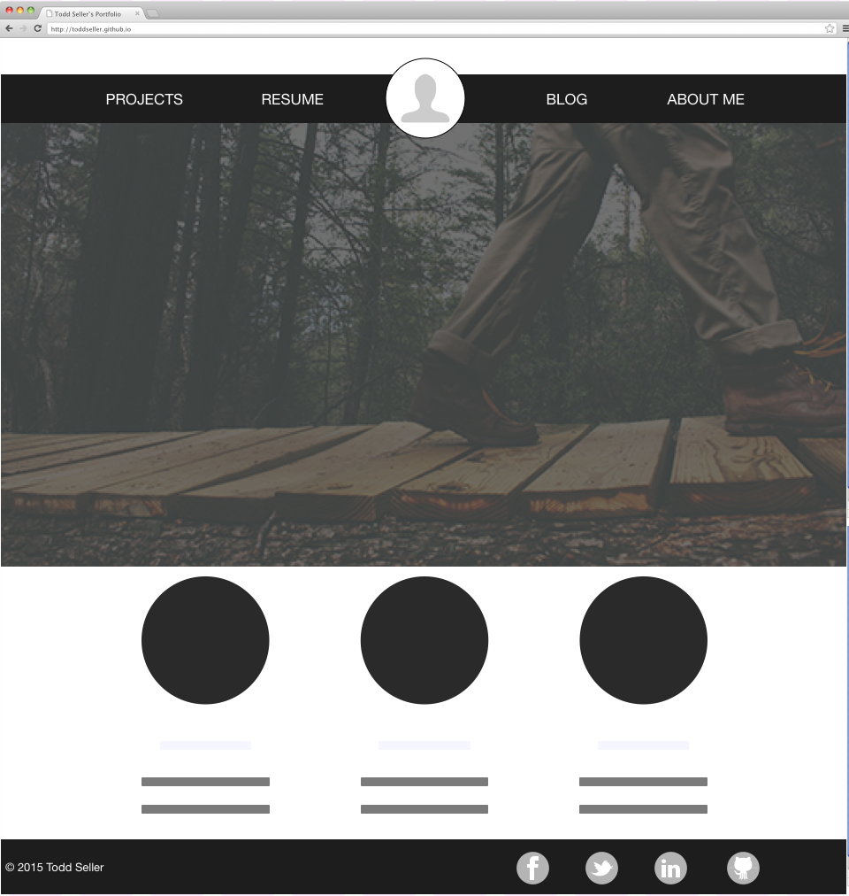
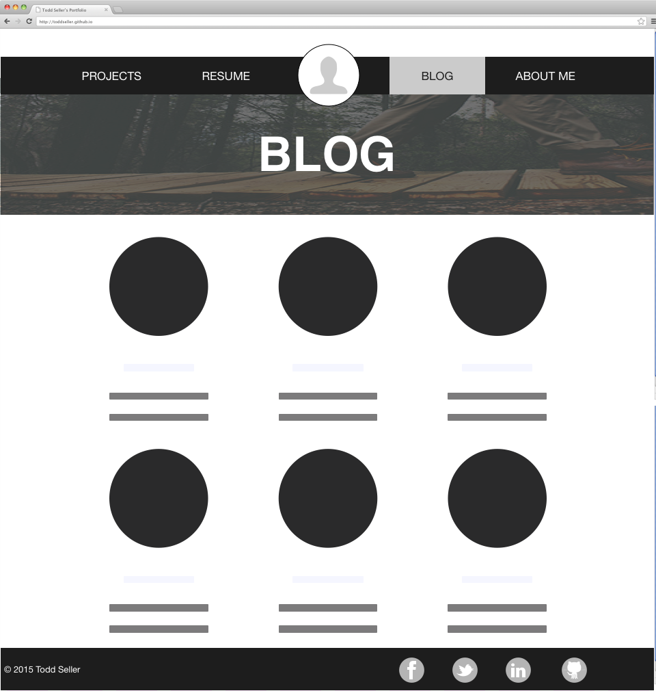

   
   
   

**What is a wireframe?**   
A wireframe is a blueprint of your site.

**What are the benefits of wireframing?**   
The benefit of wireframing is that you can quickly and easily achieve a visual layout of a website. It allows you to examine the relationship of the design layout and the usability of your site. Although, I am currently a visual designer and I often pass over the wireframing step and go straight to hi-fidelity mock-ups.

**Did you enjoy wireframing your site?**   
Yes.

**Did you revise your wireframe or stick with your first idea?**   
No. I have been thinking of creating a portfolio site for myself for awhile now, so I had a fairly good idea as far as the layout.

**What questions did you ask during this challenge? What resources did you find to help you answer them?**   
Because of my experience as a visual designer, I really didn't have any questions. Often times, however, when stuck with a layout or visual problem I look at existing sites like Apple for inspiration.

**Which parts of the challenge did you enjoy and which parts did you find tedious?**   
I enjoyed the whole process of wireframing and found working on the reflection the most tedious.