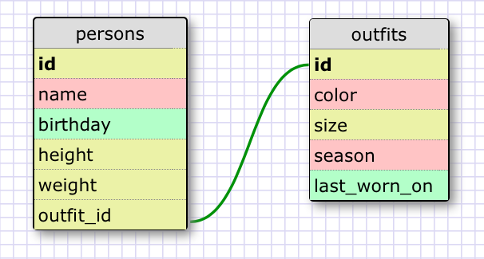

## Release 5: SELECTing data from a database   

1. SELECT * FROM states;   
2. SELECT * FROM regions;
3. SELECT state_name, population FROM states;   
4. SELECT state_name, population FROM states ORDER BY population DESC;   
5. SELECT state_name FROM states WHERE region_id = 7;   
6. SELECT state_name, population_density FROM states WHERE population_density > 50 ORDER BY population_density ASC;   
7. SELECT state_name FROM states WHERE population BETWEEN 1000000 AND 1500000;   
8. SELECT state_name, region_id FROM states ORDER BY region_id ASC;   
9. SELECT region_name FROM regions WHERE region_name LIKE '%central%';   
10. SELECT regions.region_name, states.state_name FROM regions JOIN states ON regions.id = states.region_id ORDER BY region_id ASC;

## Release 6: Your Own Schema   

## Release 7: Reflect   

#### What are databases for?   
Are designed to store information that can then be accessed and the stored value can be used and manipulated by the program.   

#### What is a one-to-many relationship?   
A one-to-many relationship is where a parent record from one table can reference several child records in another table.   

#### What is a primary key? What is a foreign key? How can you determine which is which?   
A primary key is a unique identifier of a record within a table. A foreign key provides a link between two tables. It is easy to determine the difference between a primary key and a foreign key, because a record in a database can only have one primary key yet can have several reference to a foreign key.

#### How can you select information out of a SQL database? What are some general guidelines for that?   
You would use the SELECT statement to select information out of a SQL database. When you use the SELECT statement it is important to remember to capitalize SELECT and you finish every statement with a ;.