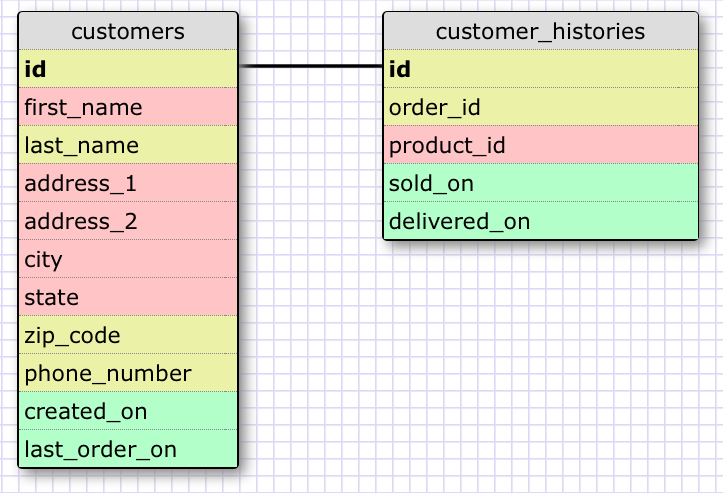
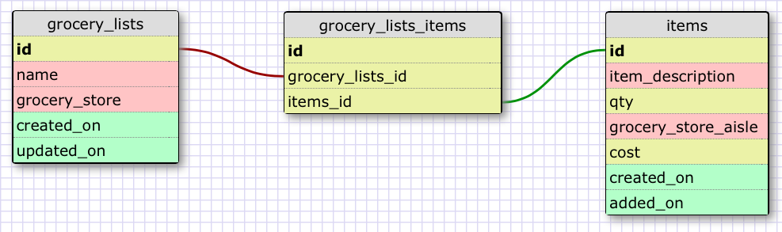

## Release 2: Create a One-to-one Schema   

This is a one-to-one relationship because a customer will only have one customer history and a customer history will only belong to one customer. Although you could combine the two into on table, this would make more sense in querying your database because a customer's history could contain an infinite number of orders and it would be very slow to find out the customer's phone number, for example, if you had their order history combined.   

## Release 4: Refactor   

   

## Release 6: Reflect   

#### What is a one-to-one database?   
One-to-one relationships associate one record in one table with a single record in another table.   

#### When would you use a one-to-one database? (Think generally, not in terms of the example you created).   
Whenever you have a set of information that has exactly one possible answer, a one-to-one database could be useful.   

#### What is a many-to-many database?   
Many-to-many relationships associate multiple records in one table and multiple records in another table, which are joined by a unifying table.   

#### When would you use a many-to-many database? (Think generally, not in terms of the example you created).
Many-to-many databases allow you to connect all sorts of different, but related info. Anytime table info looks redundant, it probably makes sense to split it up and then connect the tables.   

#### What is confusing about database schemas? What makes sense?   
I think the most confusing thing about database schemas is deciding how you want to layout the tables in a database. You not only have to figure out what makes sense at the time, but you have to be able to build-in the possibility of expansion into the design. I felt pretty comfortable with the relational concepts of tables and when it makes sense to use a specific relationship.